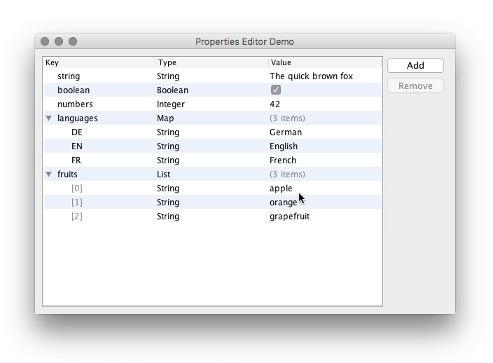

Hierarchical Property List Editor
=================================

[](https://github.com/qqilihq/property-editor/actions)
[](https://codecov.io/gh/qqilihq/property-editor)
[](http://mvnrepository.com/artifact/de.philippkatz.swing.property/property-editor)



An editor for hierarchical properties as Java Swing component. Shamelessly
inspired by Apple's Property List Editor in Xcode. It allows building data
structures based on `Map`s and `List`s and primitive types such as `Long`,
`Double`, and `Boolean`. It is originally created for the [KNIME Selenium
Nodes][1] but it could probably be of general interest.

The editor is built on top of SwingX from [SwingLabs][3].

Download
--------

Via Maven:

```xml
<dependency>
  <groupId>de.philippkatz.swing.property</groupId>
  <artifactId>property-editor</artifactId>
  <version>2.0.1</version>
</dependency>
```

Usage
-----

```java
// create a new component and pass the data
Object input = …
PropertiesTreeTableModel model = new PropertiesTreeTableModel(input);
PropertiesEditor editor = new PropertiesEditor(model);

// access to the data; this is either a Map<String, Object> or a List<Object>
Object result = model.getData();
```

Full Working Example
-----------------------

Have a look at `PropertiesEditorDemo` for a more detailed version.

```java
public class PropertiesEditorDemo {

  private static Object createSampleData() {
    Map<String, Object> root = new LinkedHashMap<>();
    root.put("string", "The quick brown fox");
    root.put("boolean", true);
    root.put("numbers", 42);
    root.put("fruits", Arrays.asList("apple", "orange", "grapefruit"));
    return root;
  }

  public static void main(String[] args) {
    JFrame frame = new JFrame();
    frame.setTitle("Properties Editor Demo");
    frame.setDefaultCloseOperation(WindowConstants.EXIT_ON_CLOSE);
    frame.setMinimumSize(new Dimension(600, 400));
    frame.add(new PropertiesEditor(new PropertiesTreeTableModel(createSampleData())));
    frame.setVisible(true);
  }

}
```

Advanced
--------

The types to use in the editor can be customized using the
`PropertiesEditorConfig`. It also allows to change the type names in the user
interface. Example:

```java
PropertiesEditorConfigBuilder configBuilder = PropertiesEditorConfig.builder();

// use "Object" and "Array" instead of "Map" and "List"
configBuilder.addType(new PropertyTypes.MapType("Object"));
configBuilder.addType(new PropertyTypes.ListType("Array"));

// only allow String and Boolean
configBuilder.addDefaultType(new PropertyTypes.StringType("String", ""));
configBuilder.addType(new PropertyTypes.BooleanType("Boolean", true));

PropertiesEditorConfig config = configBuilder.build();
PropertiesTreeTableModel model = new PropertiesTreeTableModel(config, data);
```


Contributing
------------

Pull requests are very welcome. Feel free to discuss bugs or new features by
opening a new [issue][2].

License
-------

[GNU Lesser General Public License](https://www.gnu.org/licenses/lgpl.txt)

- - -

Copyright (c) 2017 – 2020, Philipp Katz

[1]: http://seleniumnodes.com
[2]: https://github.com/qqilihq/property-editor/issues
[3]: https://en.wikipedia.org/wiki/SwingLabs
